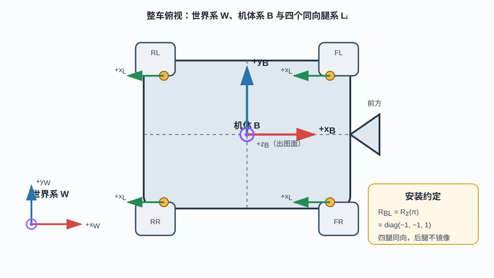
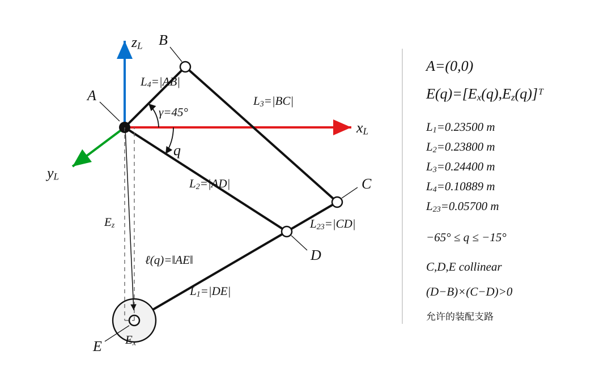
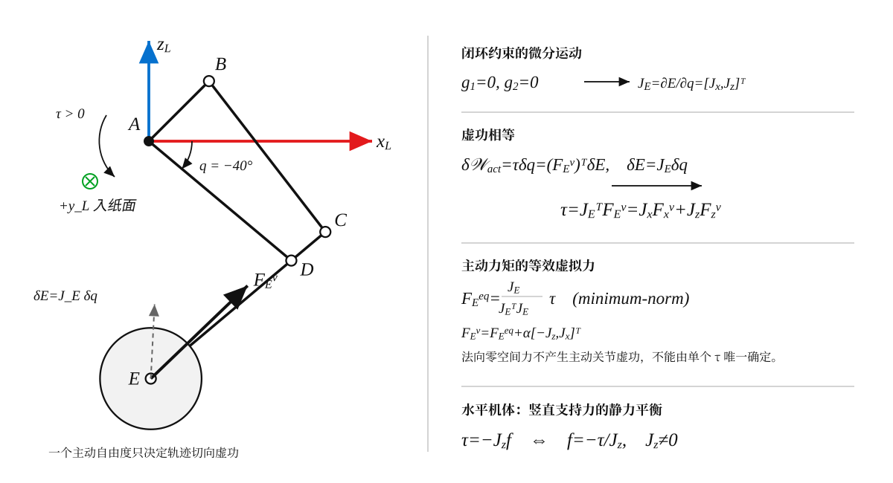
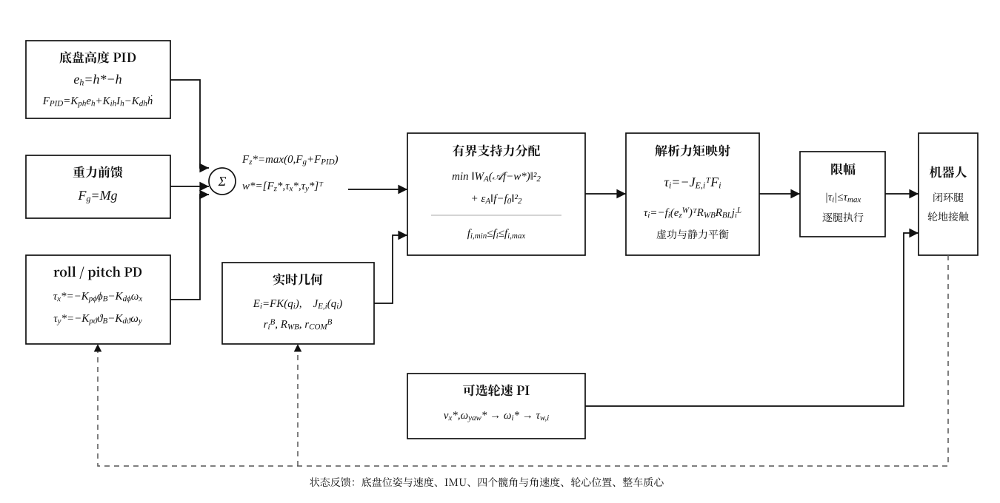
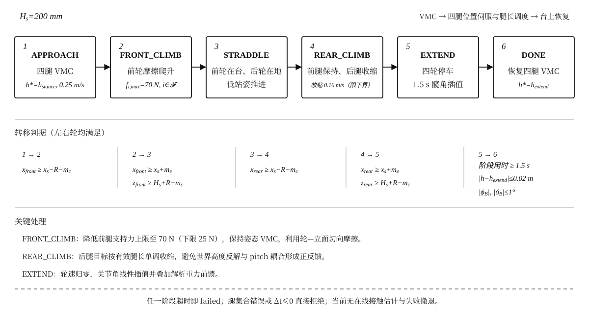

# Ascento Dog 机器人建模与控制设计

本文是仓库唯一的技术设计文档，描述当前代码实际采用的坐标约定、单腿解析运动学、四腿支持力分配、VMC 闭环和跨台阶状态机。所有公式使用国际单位制；未由实物或 CAD 确认的参数均明确标为示意值。

---

# 第一章　坐标系、连杆拓扑与符号

## 1.1 世界系、机体系与腿系

系统使用右手坐标系：

- 世界系 $W$：$+x_W$ 为场景中的前进方向，$+y_W$ 向左，$+z_W$ 竖直向上；
- 机体系 $B$：原点位于底盘刚体参考点，$+x_B$ 向前，$+y_B$ 向左，$+z_B$ 向上；
- 第 $i$ 条腿的解析系 $L_i$：原点位于髋轴 $A_i$，$(x_L,z_L)$ 是腿的矢状面，$+z_L$ 向上。

roll、pitch、yaw 分别记为 $\varphi_B,\vartheta_B,\chi_B$，是绕机体系 $+x_B,+y_B,+z_B$ 的右手转角。按这一约定，正 pitch 使机头下俯。欧拉角按 yaw–pitch–roll 顺序组成

$$
R_{WB}=R_z(\chi_B)R_y(\vartheta_B)R_x(\varphi_B).
$$

$R_{WB}$ 将机体系向量变换到世界系：

$$
v^W=R_{WB}v^B,\qquad v^B=R_{WB}^{\mathsf T}v^W.
$$

四条腿同向安装。所有解析腿系的 $+x_L$ 都指向机体 $-x_B$，即屈膝方向朝向机体后方；后腿不镜像，也不相对前腿增加额外的 $180^\circ$ 旋转。腿系到机体系的固定旋转为

$$
\boxed{R_{BL}=R_z(\pi)=
\begin{bmatrix}
-1&0&0\\
0&-1&0\\
0&0&1
\end{bmatrix}}.
$$

这一朝向可由几何数值验证：标称位形 $q_0=-40^\circ$ 下，膝关节 $C$ 与内侧关节 $D$ 在腿系中的前向坐标分别为 $+0.226\ \mathrm m$、$+0.182\ \mathrm m$（轮心 $E$ 几乎位于髋轴正下方），经 $R_{BL}$ 映射后两者都落在髋轴后方，且 $C$ 比 $D$ 更靠后——即膝的凸出点指向机体 $-x_B$ 方向。

下图采用严格二维俯视表达；蓝色圆点符号表示 $+z$ 轴的箭头垂直纸面向外。



当前 MuJoCo 示意安装点为

$$
\begin{aligned}
p_{A,FL}^B&=(+0.24,+0.20,0)^{\mathsf T},&
p_{A,FR}^B&=(+0.24,-0.20,0)^{\mathsf T},\\
p_{A,RL}^B&=(-0.24,+0.20,0)^{\mathsf T},&
p_{A,RR}^B&=(-0.24,-0.20,0)^{\mathsf T}.
\end{aligned}
$$

这些安装位置、机身 $0.60\times0.36\times0.15\ \mathrm m$ 外形和轮半径 $R=0.065\ \mathrm m$ 都是仿真示意值，不是实物标定结果。

## 1.2 单腿拓扑与几何参数

单腿有一个连杆主动自由度，车轮自转是独立执行器，不计入连杆自由度。点位定义如下：

| 点 | 含义 |
| --- | --- |
| $A$ | 髋部电机轴，也是解析腿系原点 |
| $B$ | 机身上的固定销轴 |
| $D$ | 主动杆上的内侧关节 |
| $C$ | 上、下支链闭合的膝关节 |
| $E$ | 轮心 |



几何真值为：

| 符号 | 杆件 | 长度（mm） | 长度（m） |
| --- | --- | ---: | ---: |
| $L_1$ | $DE$ | 235.00 | 0.23500 |
| $L_2$ | $AD$ | 238.00 | 0.23800 |
| $L_3$ | $BC$ | 244.00 | 0.24400 |
| $L_4$ | $AB$ | 108.89 | 0.10889 |
| $L_{23}$ | $CD$ | 57.00 | 0.05700 |

固定杆 $AB$ 与 $+x_L$ 的夹角为

$$
\gamma=45^\circ=\frac{\pi}{4}.
$$

主动角 $q$ 是从 $+x_L$ 到 $AD$ 的逆时针角，当前工作区间为

$$
\boxed{-65^\circ\le q\le-15^\circ}.
$$

$C,D,E$ 共线且 $D$ 位于 $C$ 与 $E$ 之间。二维叉积定义为

$$
u\times v=u_xv_z-u_zv_x,
$$

唯一允许的装配支路满足

$$
\boxed{(D-B)\times(C-D)>0}.
$$

## 1.3 三维装配与二维解析量的映射

解析运动学只处理腿系矢状面向量

$$
p_E^L=\begin{bmatrix}E_x&0&E_z\end{bmatrix}^{\mathsf T}.
$$

第 $i$ 个轮心在机体系中的位置为

$$
p_{E,i}^B=p_{A,i}^B+R_{BL}p_{E,i}^L,
$$

完整世界系点位变换为

$$
\boxed{p_{E,i}^W=p_B^W+R_{WB}p_{E,i}^B}.
$$

后文底盘高度统一指机体参考点的世界系 $z$ 坐标

$$
h=(p_B^W)_z.
$$

当前四个髋安装点的机体系 $z$ 坐标均为零，所以机体水平时 $h$ 也等于四个髋轴的世界系高度；它不是整车质心高度。

相对整车质心的位置为

$$
\boxed{r_i^B=p_{A,i}^B+R_{BL}p_{E,i}^L-r_{COM}^B}.
$$

MuJoCo 参考姿态采用 $q_0=-40^\circ$，其髋关节坐标记录相对偏移：

$$
q_{hip}=q-q_0.
$$

被动关节的参考偏移由第二章定义的 $\phi,\psi$ 给出：

$$
q_{inner}=(\psi-q)-(\psi_0-q_0),\qquad
q_{pin}=\phi-\phi_0.
$$

MJCF 使用两个具名 $C$ 站点和 `connect` 等式约束闭合上下支链，解析运动学始终作为 MuJoCo 点位的外部真值。

## 1.4 全文符号、下标与运算约定

后续章节只使用本节声明的符号。为避免同形符号混淆，连杆点使用普通大写字母（如 $A$），支持力分配矩阵使用花体 $\mathcal A$；世界系记为上标 $W$，分配器权重记为带下标的 $W_A$；机体高度只用 $h$，两圆求交的垂距改记为 $b_c$；有效腿长只用 $\ell$。

### 1.4.1 索引、坐标系和通用运算

| 符号 | 含义 | 单位或范围 |
| --- | --- | --- |
| $i$ | 腿索引，$i\in\{FL,FR,RL,RR\}$ | — |
| $k$ | 离散控制周期索引 | — |
| $FL,FR,RL,RR$ | 左前、右前、左后、右后腿 | — |
| $W,B,L_i$ | 世界系、机体系、第 $i$ 条腿解析系 | — |
| $p_X^Y$ | 点 $X$ 在坐标系 $Y$ 中的位置向量 | m |
| $v^Y$ | 任意向量在坐标系 $Y$ 中的分量表示 | 随向量确定 |
| $R_{XY}$ | 把 $Y$ 系向量变换到 $X$ 系的旋转矩阵 | $SO(3)$ |
| $e_x^Y,e_y^Y,e_z^Y$ | 坐标系 $Y$ 的三个单位基向量 | — |
| $(\cdot)^{\mathsf T}$ | 转置；旋转矩阵的转置也是逆矩阵 | — |
| $I$ | 与上下文维数一致的单位矩阵 | — |
| $\dot{(\cdot)}$、$(\cdot)'$ | 对时间 $t$、主动角 $q$ 的导数 | 随被导量确定 |
| $(\cdot)^*$ | 目标值或期望值 | 随被标量确定 |
| $(\cdot)_0$、$\delta(\cdot)$ | 标称或参考值、无穷小虚变分 | 随被标量确定 |
| $(\cdot)_x,(\cdot)_y,(\cdot)_z$ | 向量在对应坐标轴上的分量 | 随被向量确定 |
| $\|x\|_2$、$u\times v$ | 二范数、右手叉积；二维叉积取 $xz$ 平面的标量结果 | — |
| $\operatorname{clip}(x,l,u)$ | 将 $x$ 限制到闭区间 $[l,u]$ | 随 $x$ 确定 |
| $\operatorname{diag}(\cdot)$、$\operatorname{atan2}(z,x)$ | 对角矩阵、保象限反正切 | —、rad |
| $\min,\max,\arg\min$ | 最小值、最大值、使目标最小的自变量 | — |
| $\Delta t$、$t$ | 离散控制周期、连续或仿真时间 | s |

全文坐标轴配色按学术图示惯例固定为：$x$ 轴红色、$y$ 轴绿色、$z$ 轴蓝色；每根坐标轴都使用正方向箭头。该配色只表达轴向，不表示连杆、力或控制模块的类别。

### 1.4.2 单腿几何、运动学与虚功

| 符号 | 含义 | 单位或范围 |
| --- | --- | --- |
| $A,B,C,D,E$ | 髋轴、固定销、闭环膝、主动杆内侧关节、轮心 | m |
| $L_1,L_2,L_3,L_4,L_{23}$ | 杆长 $DE,AD,BC,AB,CD$ | m |
| $\gamma$ | 固定杆 $AB$ 相对 $+x_L$ 的角度 | $45^\circ$ |
| $q,q_i,q=[q_i],q_{min},q_{max},q_0$ | 单腿主动髋角、第 $i$ 腿髋角、四腿髋角向量、工作区间端点、标称髋角 | rad；$q_0=-40^\circ$ |
| $\phi,\psi$ | 被动杆 $BC$、$DC$ 的绝对方向角 | rad |
| $E(q)=[E_x,E_z]^{\mathsf T}$ | 轮心在腿系矢状面的位置 | m |
| $\ell(q)=\|E(q)-A\|_2$ | 髋轴到轮心的有效腿长 | m |
| $s,d,e,e_\perp$ | 正运动学中的 $D-B$、其长度、单位方向和垂直单位方向 | m、m、—、— |
| $a_c,b_c$ | 两圆公共弦中心沿 $e$ 的投影距离、垂直距离 | m |
| $s_E,\rho,n,n_\perp$ | 逆运动学中的 $E-A$、其长度、单位方向和垂直单位方向 | m、m、—、— |
| $a_D,b_D$ | 逆运动学两圆交点沿 $n$ 的投影距离、垂距 | m |
| $u=C-B,v=C-D$ | 闭环约束的两条方向向量 | m |
| $g_1,g_2$ | 杆长 $BC$、$CD$ 的平方闭环约束函数 | m² |
| $\Delta,\beta,\lambda$ | $u\times v$、$v^{\mathsf T}D'$、长度比 $L_1/L_{23}$ | m²、m²/rad、— |
| $\varepsilon_{IK}$ | IK 闭环与回代位置容差 | m |
| $E_{target},E_{FK}(q)$ | 逆运动学输入的目标轮心、候选角回代 FK 后的轮心 | m |
| $J_E=[J_x,J_z]^{\mathsf T}=\partial E/\partial q$ | 轮心相对主动角的解析雅可比 | m/rad |
| $j_i^L=[J_x(q_i),0,J_z(q_i)]^{\mathsf T}$ | 第 $i$ 条腿嵌入三维的雅可比列向量 | m/rad |
| $F_E^v=[F_x^v,F_z^v]^{\mathsf T}$ | 主动关节在轮心处等效施加的腿系虚拟力 | N |
| $F_E^{ext}$ | 环境施加在轮心上的腿系外力 | N |
| $F_E^{eq},F_E^\perp,\alpha$ | 主动力矩的最小范数等效虚拟力、雅可比零空间力及其任意标量系数 | N、N、N·rad/m |
| $\tau$ | 单腿主动关节力矩；正方向与主动角 $q$ 一致 | N·m |
| $\delta E,\delta q,\delta\mathcal W_{act},\delta\mathcal W_v$ | 轮心虚位移、主动角虚变分、主动关节与虚拟力的虚功 | m、rad、J、J |
| $Q_q^{ext}=J_E^{\mathsf T}F_E^{ext}$ | 轮心外力产生的主动关节广义力 | N·m |
| $q_{hip},q_{inner},q_{pin}$ | MuJoCo 主动髋、内侧被动和固定销关节坐标 | rad |
| $FK,IK$ | 正运动学、逆运动学映射 | — |

### 1.4.3 整机受力分配与 VMC

| 符号 | 含义 | 单位或范围 |
| --- | --- | --- |
| $p_B^W,p_{A,i}^B,p_{E,i}^L,p_{E,i}^B,p_{E,i}^W$ | 机体原点、髋点和轮心在相应坐标系中的位置 | m |
| $r_{COM}^B,r_i^B$ | 整车质心位置、轮心相对整车质心的位置 | m |
| $x_i,y_i$ | $r_i^B$ 的机体系前向、横向分量 | m |
| $h=(p_B^W)_z,\dot h,h^*$ | 底盘参考点高度、高度速度和高度目标 | m、m/s、m |
| $M,g,F_g=Mg$ | 整车总质量、重力加速度、重力前馈 | kg、m/s²、N |
| $\varphi_B,\vartheta_B,\chi_B$ | 机体 roll、pitch、yaw 角 | rad |
| $\omega_x,\omega_y,\omega_z$ | 机体系 roll、pitch、yaw 角速度 | rad/s |
| $w^*=[F_z^*,\tau_x^*,\tau_y^*]^{\mathsf T}$ | 目标竖直力、roll 力矩和 pitch 力矩组成的目标广义力 | N、N·m、N·m |
| $F_i^W=f_i e_z^W$ | 第 $i$ 个轮子的世界系竖直地面反力 | N |
| $n^B=R_{WB}^{\mathsf T}e_z^W$ | 世界竖直方向在机体系中的表示 | — |
| $m_i^B,a_i=r_i^B\times n^B$ | 单腿对机体的力矩、单位支持力对应的力矩列 | N·m、m |
| $\mathcal A$ | 将四腿支持力映射到 $[F_z,\tau_x,\tau_y]^{\mathsf T}$ 的 $3\times4$ 分配矩阵 | 混合量纲 |
| $f=[f_{FL},f_{FR},f_{RL},f_{RR}]^{\mathsf T}$ | 四腿竖直支持力向量 | N |
| $a_x,b_y$ | 水平对称姿态下的半轴距、半轮距 | m |
| $f_{i,min},f_{i,max},f_{min},f_{max},f_0$ | 单腿支持力界、四腿边界向量和均匀承载参考向量 | N |
| $r_h,W_A$ | 最大水平力臂、分配残差的量纲归一权重矩阵 | m、混合量纲 |
| $\varepsilon_A$ | 支持力分配参考项的极小正则权重 | — |
| $r_w=\mathcal A f-w^*$ | 支持力分配残差 | N、N·m、N·m |
| $\tau_i,\tau_{max}$ | 第 $i$ 个髋电机力矩及其绝对值上限 | N·m |

### 1.4.4 高度环、姿态环和轮速环

| 符号 | 含义 | 单位或范围 |
| --- | --- | --- |
| $e_h=h^*-h$ | 底盘高度误差 | m |
| $K_{ph},K_{ih},K_{dh}$ | 高度 PID 比例、积分、微分增益 | N/m、N/(m·s)、N·s/m |
| $I_h,I_{h,k}^{cand},I_{max},e_{h,k}$ | 高度误差积分、离散候选积分、积分绝对值上限、第 $k$ 拍高度误差 | m·s、m·s、m·s、m |
| $F_{PID},F_{raw},F_{max}$ | 高度 PID 输出、未限幅输出、输出绝对值上限 | N |
| $K_{p\varphi},K_{d\varphi},K_{p\vartheta},K_{d\vartheta}$ | roll/pitch 姿态 PD 增益 | N·m/rad、N·m·s/rad |
| $v_x^*,\omega_{yaw}^*,y_i,R$ | 目标前进速度、目标 yaw 速率、轮子横坐标、轮半径 | m/s、rad/s、m、m |
| $v_{x,i},\omega_i^*$ | 第 $i$ 个轮心目标线速度和轮目标角速度 | m/s、rad/s |
| $e_{\omega,i}$ | 第 $i$ 个轮子的角速度误差 | rad/s |
| $K_{pw},K_{iw}$ | 轮速 PI 比例与积分增益 | N·m·s/rad、N·m/rad |
| $\tau_{w,i},\tau_{w,max}$ | 第 $i$ 个轮电机力矩及其绝对值上限 | N·m |

### 1.4.5 台阶状态机专用符号

| 符号 | 含义 | 单位或范围 |
| --- | --- | --- |
| $H_s,x_s,R$ | 台阶高度、立面世界系 $x$ 位置、轮半径 | m |
| $x_i^W,z_i^W$ | 第 $i$ 个轮心的世界系前向和竖直坐标 | m |
| $\mathcal F,\mathcal R$ | 两条前腿、两条后腿的索引集合 | — |
| $x_{front},z_{front},x_{rear},z_{rear}$ | 状态机图中的简写：对应前轴或后轴左右轮世界坐标的最小值 | m |
| $m_c,m_e$ | 接触判据余量、越过边缘余量 | m |
| $N,\mu$ | 轮子顶住立面的法向力、摩擦系数 | N、— |
| $d_{min},d_0$ | 最短腿、标称腿姿态的轮心竖直下探量 | m |
| $h_{stance},h_{extend}$ | 跨越低站姿高度、台上标称高度 | m |
| $\ell_s,\ell_{min},v_\ell$ | 后轮爬升初始腿长、最短腿长、腿长收缩速度 | m、m、m/s |
| $q_{front}^*,q_{rear}^*,q_{i,s}$ | 前腿锁定目标、后腿轨迹目标、进入恢复阶段时的髋角 | rad |
| $K_{p,q},K_{d,q}$ | 跨越阶段关节位置伺服刚度与阻尼 | N·m/rad、N·m·s/rad |
| $T_{extend},\sigma(t)$ | 台上姿态恢复插值时长、$[0,1]$ 插值因子 | s、— |
| $\tau_{g,i}$ | `EXTEND` 阶段第 $i$ 条腿的重力前馈力矩 | N·m |
| `APPROACH` … `DONE` | 接近、前轮爬升、跨坐、后轮爬升、台上恢复、完成六个离散状态 | — |

---

# 第二章　单腿 VMC、正逆运动学与解析雅可比

## 2.1 正运动学闭式解

给定髋角 $q$，固定点和主动点直接为

$$
A=\begin{bmatrix}0\\0\end{bmatrix},\qquad
B=L_4\begin{bmatrix}\cos\gamma\\\sin\gamma\end{bmatrix},\qquad
D=L_2\begin{bmatrix}\cos q\\\sin q\end{bmatrix}.
$$

点 $C$ 同时满足

$$
\|C-B\|=L_3,\qquad \|C-D\|=L_{23}.
$$

定义

$$
s=D-B,\qquad d=\|s\|,\qquad
e=\frac{s}{d},\qquad
e_\perp=\begin{bmatrix}-e_z\\e_x\end{bmatrix}.
$$

两圆公共弦在 $e$ 方向上的投影和垂直距离分别记为 $a_c,b_c$：

$$
a_c=\frac{L_3^2-L_{23}^2+d^2}{2d},\qquad
b_c=\sqrt{L_3^2-a_c^2}.
$$

两个候选闭合点为

$$
C_\pm=B+a_ce\pm b_ce_\perp.
$$

因为

$$
(D-B)\times(C_\pm-D)=\pm db_c,
$$

选定支路对应正号：

$$
\boxed{C=B+a_ce+b_ce_\perp}.
$$

闭环存在实解的必要条件是

$$
|L_3-L_{23}|\le d\le L_3+L_{23}.
$$

其中 $d=0$ 时方向 $e$ 未定义；等号对应 $b_c=0$ 的两圆相切位形，此时严格支路条件不成立且雅可比奇异。它们即使有几何交点，也不是本项目可接受的工作支路状态。

由 $C,D,E$ 的共线关系得到

$$
\boxed{E=D+\frac{L_1}{L_{23}}(D-C)}.
$$

两根被动杆的绝对方向角为

$$
\phi=\operatorname{atan2}(C_z-B_z,C_x-B_x),\qquad
\psi=\operatorname{atan2}(C_z-D_z,C_x-D_x).
$$

至此，$A,B,C,D,E,\phi,\psi$ 都是 $q$ 和固定杆长的显式解析函数。

## 2.2 笛卡尔逆运动学闭式解

单自由度腿的轮心工作空间是一条一维曲线，不是二维区域。给定腿系目标轮心 $E^L=(E_x,E_z)$，先求同时位于圆 $(A,L_2)$ 与圆 $(E,L_1)$ 上的 $D$。必须先满足

$$
\rho=\|E-A\|>0,
\qquad
|L_2-L_1|\le\rho\le L_2+L_1;
$$

否则两圆无有效交点。定义

$$
s_E=E-A,\qquad \rho=\|s_E\|,\qquad
n=\frac{s_E}{\rho},\qquad
n_\perp=\begin{bmatrix}-n_z\\n_x\end{bmatrix},
$$

$$
a_D=\frac{L_2^2-L_1^2+\rho^2}{2\rho},\qquad
b_D=\sqrt{L_2^2-a_D^2}.
$$

两组候选主动点为

$$
\boxed{D_\pm=A+a_Dn\pm b_Dn_\perp}.
$$

对每个候选点重建

$$
C=D+\frac{L_{23}}{L_1}(D-E),
$$

然后依次要求

$$
\left|\|C-B\|-L_3\right|\le\varepsilon_{IK},
$$

$$
(D-B)\times(C-D)>0,
$$

$$
q_{min}\le \operatorname{atan2}(D_z,D_x)\le q_{max}.
$$

通过全部检查的闭式逆解为

$$
\boxed{q=\operatorname{atan2}(D_z,D_x)}.
$$

若 $L_2^2-a_D^2<0$、候选点退化或没有候选点通过，目标不是这条一维轨迹上的可达点，算法报错而不是投影。最后还必须回代正运动学并验证 $\|E_{FK}(q)-E_{target}\|\le\varepsilon_{IK}$；公共接口默认 $\varepsilon_{IK}=10^{-8}\ \mathrm m$。若数值容差内出现多个候选，选择回代误差最小者；在当前工作支路内测试期望唯一解。代码中的 `inverse_height(z)` 只针对工作支路上单调的 $E_z(q)$ 使用区间二分，它是高度目标辅助接口，不替代上述二维闭式逆解。

## 2.3 单腿 VMC：虚拟力、解析雅可比与虚功映射

### 2.3.1 轮心虚拟力定义

VMC 不直接给主动关节指定位置轨迹，而是在轮心 $E$ 处定义希望主动关节等效产生的平面虚拟力

$$
\boxed{F_E^v=
\begin{bmatrix}F_x^v\\F_z^v\end{bmatrix}},
$$

其中 $F_x^v>0$、$F_z^v>0$ 分别沿腿系 $+x_L$、$+z_L$。$F_E^v$ 定义为“腿通过主动关节施加到轮心上的等效力”；环境施加给轮心的接触力另记为 $F_E^{ext}$，二者在静力平衡时方向相反。主动关节力矩 $\tau>0$ 与主动角 $q$ 的正方向一致。



单腿连杆只有一个主动自由度，因此二维虚拟力并非两个分量都能独立实现。主动关节只能产生轮心轨迹切向上的虚功；与轨迹法向平行的力属于该瞬时运动的零空间，不改变主动关节力矩。

### 2.3.2 闭环约束给出的解析雅可比

轮心微分运动定义解析雅可比

$$
J_E(q)=\frac{\partial E}{\partial q}
=\begin{bmatrix}J_x(q)\\J_z(q)\end{bmatrix},
\qquad
\delta E=J_E(q)\delta q.
$$

为得到不依赖数值差分的闭式结果，定义两条闭环约束

$$
g_1=(C-B)^{\mathsf T}(C-B)-L_3^2=0,
$$

$$
g_2=(C-D)^{\mathsf T}(C-D)-L_{23}^2=0.
$$

对主动角 $q$ 求导得到

$$
(C-B)^{\mathsf T}C'=0,
\qquad
(C-D)^{\mathsf T}(C'-D')=0,
$$

其中

$$
D'=L_2\begin{bmatrix}-\sin q\\\cos q\end{bmatrix}.
$$

令

$$
u=C-B=\begin{bmatrix}u_x\\u_z\end{bmatrix},\qquad
v=C-D=\begin{bmatrix}v_x\\v_z\end{bmatrix},
$$

$$
\Delta=u_xv_z-u_zv_x,
\qquad
\beta=v^{\mathsf T}D'
=L_2(-v_x\sin q+v_z\cos q),
$$

则闭环约束导数方程的显式解为

$$
\boxed{
C'=\frac{\beta}{\Delta}
\begin{bmatrix}-u_z\\u_x\end{bmatrix}}.
$$

又因为

$$
E=(1+\lambda)D-\lambda C,
\qquad
\lambda=\frac{L_1}{L_{23}},
$$

所以轮心雅可比的两个解析分量为

$$
\boxed{
J_x(q)=-(1+\lambda)L_2\sin q
+\lambda\frac{u_z\beta}{\Delta}},
$$

$$
\boxed{
J_z(q)=(1+\lambda)L_2\cos q
-\lambda\frac{u_x\beta}{\Delta}}.
$$

速度关系与虚位移关系因此分别为

$$
\boxed{\dot E=J_E(q)\dot q},
\qquad
\boxed{\delta E=J_E(q)\delta q}.
$$

### 2.3.3 由虚功得到虚拟力到主动力矩

主动关节与轮心虚拟力在任意相容虚位移上的功必须相等：

$$
\delta\mathcal W_{act}=\tau\,\delta q,
\qquad
\delta\mathcal W_v=(F_E^v)^{\mathsf T}\delta E.
$$

代入 $\delta E=J_E\delta q$，可得

$$
\tau\,\delta q
=(F_E^v)^{\mathsf T}J_E\delta q.
$$

由于该式对任意 $\delta q$ 都成立，得到 VMC 的力—力矩对偶关系

$$
\boxed{\tau=J_E^{\mathsf T}F_E^v
=J_xF_x^v+J_zF_z^v}.
$$

对于环境外力，同一雅可比给出外力产生的广义力

$$
Q_q^{ext}=J_E^{\mathsf T}F_E^{ext}.
$$

静力平衡要求

$$
\boxed{\tau+Q_q^{ext}=0}.
$$

因此，“主动关节等效施加的虚拟力”使用 $\tau=J_E^{\mathsf T}F_E^v$；“电机抵消环境外力”使用 $\tau=-J_E^{\mathsf T}F_E^{ext}$，负号来自作用对象和力方向的定义，不能省略。

对第 $i$ 条腿，将平面雅可比嵌入三维：

$$
j_i^L=\begin{bmatrix}J_x(q_i)\\0\\J_z(q_i)\end{bmatrix}.
$$

若世界系竖直地面支持力为 $F_i^W=f_i e_z^W$，则静力抵消所需髋力矩为

$$
\boxed{
\tau_i=-f_i(e_z^W)^{\mathsf T}R_{WB}R_{BL}j_i^L}.
$$

机体无 roll/pitch（允许 yaw）时，$R_{WB}$ 不改变向量的 $z$ 分量；$R_{BL}$ 同样不改变 $z$ 分量，故退化为

$$
\boxed{\tau_i=-J_z(q_i)f_i}.
$$

### 2.3.4 主动力矩到虚拟力

给定主动力矩 $\tau$ 时，需要寻找满足

$$
J_E^{\mathsf T}F_E^v=\tau
$$

的轮心虚拟力。由于 $J_E^{\mathsf T}$ 是 $1\times2$ 矩阵，一个标量力矩不能唯一确定两个力分量。所有解可写为

$$
\boxed{
F_E^v=F_E^{eq}+F_E^\perp},
$$

其中最小二范数等效力为

$$
\boxed{
F_E^{eq}=\frac{J_E}{J_E^{\mathsf T}J_E}\,\tau
=\frac{\tau}{J_x^2+J_z^2}
\begin{bmatrix}J_x\\J_z\end{bmatrix}},
$$

而任意零空间力为

$$
\boxed{
F_E^\perp=\alpha
\begin{bmatrix}-J_z\\J_x\end{bmatrix}},
\qquad
J_E^{\mathsf T}F_E^\perp=0.
$$

$F_E^{eq}$ 与轮心轨迹切向 $J_E$ 平行，是给定主动力矩对应的唯一最小范数虚拟力；$F_E^\perp$ 不产生主动关节虚功，不能仅凭单个主动力矩观测或控制。

若控制设计明确只允许竖直虚拟力，即 $F_x^v=0$，且 $J_z\ne0$，则映射退化为唯一标量关系

$$
\boxed{F_z^v=\frac{\tau}{J_z}}.
$$

对于环境向上的支持力 $f$，静力平衡采用相反符号：

$$
\boxed{f=-\frac{\tau}{J_z}}.
$$

这也是诊断或估算环节从髋力矩反推等效支持力时应使用的关系。若 $J_z$ 接近零，竖直力反解会严重放大误差；若 $J_E^{\mathsf T}J_E=0$，机构在该瞬时完全失去主动运动方向，二维最小范数反解也不存在。

### 2.3.5 工作区间结果与奇异性

$\Delta=0$ 表示两个闭环约束梯度线性相关，机构处于几何奇异位形；实现会显式拒绝该状态。当前工作区间内的代表性结果为：

| $q$ | $E_x$（m） | $E_z$（m） | $J_x$（m/rad） | $J_z$（m/rad） |
| ---: | ---: | ---: | ---: | ---: |
| $-65^\circ$ | 0.012709 | -0.433653 | -0.204684 | 0.270075 |
| $-40^\circ$ | 0.002526 | -0.304309 | 0.017354 | 0.343462 |
| $-15^\circ$ | 0.000186 | -0.111206 | -0.022686 | 0.620168 |

轮心在全工作区间的竖直行程约为 $0.32245\ \mathrm m$，水平总偏移约为 $0.01352\ \mathrm m$，因此轨迹是“近似竖直”，不是严格竖直。虚拟力反解仍必须使用完整的 $J_E$ 或显式声明只取竖直分量，不能把近似竖直轨迹直接当作 $J_x=0$。

## 2.4 单腿验证要求

`tests/test_four_bar.py` 与 `tests/test_mujoco_leg.py` 必须覆盖：

- 五条杆件的长度残差与装配支路符号；
- 工作区间和两端附近的 `IK(FK(q))`；
- 离开一维轮心轨迹的目标被拒绝；
- 上述解析雅可比与中心差分一致；
- MuJoCo 的 $A$–$E$ 站点与解析点位一致；
- 两个 $C$ 站点的闭环误差保持在既定容差内。

既有数值容差（当前回归门槛，不是实物精度指标）：杆长残差 $<10^{-12}\ \mathrm m$；`IK(FK(q))` 往返误差 $\le10^{-10}\ \mathrm{rad}$（端点附近放宽到 $2\times10^{-9}$）；解析雅可比与中心差分一致 $\le2\times10^{-9}$；MuJoCo 站点与解析点位一致 $\le2\times10^{-9}\ \mathrm m$（整车 $\le3\times10^{-9}$）；两个 $C$ 站点闭环残差静置 $<10^{-6}\ \mathrm m$、动力学过程最大 $<10^{-3}\ \mathrm m$（整车等式约束 $<3\times10^{-9}$）。

---

# 第三章　四腿支持力、力矩分配与力控映射

## 3.1 目标广义力

当前 VMC 只分配世界系竖直支持力，并控制机体 roll/pitch。目标广义力定义为

$$
w^*=\begin{bmatrix}F_z^*\\\tau_x^*\\\tau_y^*\end{bmatrix}.
$$

第 $i$ 个轮子的地面反力为

$$
F_i^W=f_i e_z^W,\qquad f_i\ge0,
$$

其中 $e_z^W=[0,0,1]^{\mathsf T}$。世界竖直方向在机体系中的表示为

$$
n^B=R_{WB}^{\mathsf T}e_z^W.
$$

## 3.2 姿态相关的支持力分配矩阵

利用第一章定义的轮心相对质心位置 $r_i^B$，第 $i$ 条腿对机体产生的力矩为

$$
m_i^B=r_i^B\times(f_i n^B).
$$

定义

$$
a_i=r_i^B\times n^B,
$$

以及腿序固定为

$$
f=\begin{bmatrix}f_{FL}&f_{FR}&f_{RL}&f_{RR}\end{bmatrix}^{\mathsf T}.
$$

则

$$
\boxed{\mathcal A f=w^*},
$$

其中

$$
\boxed{
\mathcal A=
\begin{bmatrix}
1&1&1&1\\
a_{FL,x}&a_{FR,x}&a_{RL,x}&a_{RR,x}\\
a_{FL,y}&a_{FR,y}&a_{RL,y}&a_{RR,y}
\end{bmatrix}}.
$$

$\mathcal A$ 每个控制周期都由实时 $R_{WB}$、质心和四个轮心位置重建，所以公式在机体已有 roll/pitch 时仍成立。轮心到接触点沿世界竖直方向的偏移与支持力共线，不改变该力对质心的力矩，因此可直接使用轮心位置。

## 3.3 水平对称姿态的显式四腿解

当机体水平时

$$
n^B=\begin{bmatrix}0\\0\\1\end{bmatrix},\qquad
r_i^B\times n^B=\begin{bmatrix}y_i\\-x_i\\0\end{bmatrix}.
$$

若前后轮心位于 $x=\pm a_x$，左右轮心位于 $y=\pm b_y$，最小范数对称解为

$$
\boxed{
f_{FL}=\frac{F_z^*}{4}+\frac{\tau_x^*}{4b_y}-\frac{\tau_y^*}{4a_x}}
$$

$$
\boxed{
f_{FR}=\frac{F_z^*}{4}-\frac{\tau_x^*}{4b_y}-\frac{\tau_y^*}{4a_x}}
$$

$$
\boxed{
f_{RL}=\frac{F_z^*}{4}+\frac{\tau_x^*}{4b_y}+\frac{\tau_y^*}{4a_x}}
$$

$$
\boxed{
f_{RR}=\frac{F_z^*}{4}-\frac{\tau_x^*}{4b_y}+\frac{\tau_y^*}{4a_x}}.
$$

因此，总支持力改变四腿力之和；roll 力矩改变左右差；pitch 力矩改变前后差。实际控制不强制四腿等载，而是使用实时质心和轮心位置。

## 3.4 有界支持力解算

轮地法向力只能推地，不能拉地：

$$
f_{i,min}\le f_i\le f_{i,max},\qquad f_{i,min}\ge0.
$$

上下界都按腿独立可设（向量输入）：普通 VMC 取 $f_{i,min}=0,\ f_{i,max}=120\ \mathrm N$，跨台阶 `FRONT_CLIMB` 阶段把两条前腿上限单独降到 $70\ \mathrm N$（见 §5.3）。

当前分配器始终求解同一个带边界目标：

$$
\boxed{
\min_f\ \|W_A(\mathcal A f-w^*)\|_2^2
+\varepsilon_A\|f-f_0\|_2^2}
$$

并满足全部力边界。令

$$
r_h=\max_i\sqrt{r_{i,x}^2+r_{i,y}^2},\qquad
W_A=\operatorname{diag}(1,1/r_h,1/r_h),
$$

$$
f_{0,i}=\operatorname{clip}\left(\frac{\max(0,F_z^*)}{4},f_{i,min},f_{i,max}\right),
\qquad \varepsilon_A=10^{-12}.
$$

$W_A$ 用当前最大水平力臂 $r_h$ 对力和力矩残差做量纲归一，极小的 $\varepsilon_A$ 用于在近似等残差解之间偏向均匀承载，而不是严格的词典序保证。即目标广义力不可实现时，分配器不会优先保证总举升力 $F_z^*$ 而牺牲姿态力矩，也不会反过来——它只按归一化残差最小化整体误差。若实机要求“先保浮空、再保姿态”的降级顺序，需要在分配器外层另行设计。四条腿各有“下界、自由、上界”三种状态，当前实现穷举

$$
3^4=81
$$

组有效集，在可行候选中选择代价最小者。分配器同时返回

$$
r_w=\mathcal A f-w^*,
$$

以显式报告目标广义力的不可实现程度。

## 3.5 从四腿支持力到四个髋力矩

对每条腿分别计算 $j_i^L(q_i)$，然后执行第二章的静力映射：

$$
\boxed{
\tau_i=-f_i(e_z^W)^{\mathsf T}R_{WB}R_{BL}j_i^L,
\quad i\in\{FL,FR,RL,RR\}}.
$$

完整链路为

$$
w^*\longrightarrow
f^*=\underset{f_{min}\le f\le f_{max}}{\arg\min}\,
\left(\|W_A(\mathcal A f-w^*)\|_2^2+\varepsilon_A\|f-f_0\|_2^2\right)
\longrightarrow
\tau_i=-f_i(e_z^W)^{\mathsf T}R_{WB}R_{BL}j_i^L.
$$

支持力先经过单腿力上限，髋力矩再独立限幅。两级限幅是不同约束：前者限制可分配接触力，后者限制执行器命令。当前尚未实现接触状态估计；若车轮失联，分配器不会自动移除该腿，这是后续安全状态机必须解决的问题。

---

# 第四章　完整控制框架

## 4.1 闭环信号流



软件分层如下：

| 层 | 文件 | 职责 |
| --- | --- | --- |
| 解析运动学 | `ascento_dog/kinematics/four_bar.py` | FK、IK、工作支路、解析雅可比 |
| 控制器 | `ascento_dog/control/vmc.py` | 高度 PID、姿态 PD、有界支持力分配、髋力矩映射 |
| 轮速控制 | `ascento_dog/control/wheel_speed.py` | 驱动运动学、四轮独立 PI、键盘按住命令 |
| 仿真适配 | `mujoco/simulation/mujoco_vmc.py` | 状态读取、模型质量和质心读取、指令写入、扰动 |
| 动力学 | `mujoco/quadruped.xml` | 自由底盘、四个闭环腿、重力、轮地接触、IMU 和执行器 |
| 入口 | `ascento_dog/scripts/vmc.py` | 参数解析、Viewer、目标高度和遥控编排 |

## 4.2 底盘高度 PID

高度误差定义为

$$
e_h=h^*-h.
$$

高度反馈只产生相对重力前馈的附加推力：

$$
\boxed{
F_{PID}=K_{ph}e_h+K_{ih}I_h-K_{dh}\dot h}.
$$

微分项对测量高度速度 $\dot h$ 作用，不对误差差分，因此目标高度阶跃不会产生微分冲击。当前 $\dot h$ 由仿真状态真值提供；实机需要传感器或估计器，本文不讨论观测器设计。离散积分候选为

$$
I_{h,k}^{cand}=\operatorname{clip}
\left(I_{h,k-1}+e_{h,k}\Delta t,-I_{max},I_{max}\right).
$$

先用候选积分计算未限幅输出 $F_{raw}$，再执行

$$
F_{PID}=\operatorname{clip}(F_{raw},-F_{max},F_{max}).
$$

设未限幅输出为

$$
F_{raw}=K_{ph}e_{h,k}+K_{ih}I_{h,k}^{cand}-K_{dh}\dot h_k,
$$

仅在

$$
F_{raw}=F_{PID}\ \text{（未饱和）},
$$

或当前误差会把饱和输出拉回允许区间，即

$$
\bigl(F_{raw}>F_{max}\land e_{h,k}<0\bigr)
\lor\bigl(F_{raw}<-F_{max}\land e_{h,k}>0\bigr)
$$

时接受 $I_{h,k}^{cand}$；否则积分状态保持上一拍不变。这就是条件积分抗饱和。`reset()` 会清空积分状态。高度环没有隐藏的腿长位置环，PID 输出单位直接是牛顿。当前抗饱和只感知 $F_{PID}$ 自身的限幅，不会根据后续的 $F_z^*\ge0$、单腿力饱和或髋力矩饱和做反算。

## 4.3 重力前馈

整车总质量 $M$ 从编译后的 MuJoCo 模型读取，不在控制器内重复硬编码：

$$
\boxed{F_g=Mg}.
$$

当前编译模型为 $M\approx20.6\ \mathrm{kg}$、$F_g\approx203\ \mathrm N$（随 MJCF 改动而变化，控制器不依赖该数值本身）。

目标总支持力为

$$
\boxed{F_z^*=\max(0,F_g+F_{PID})}.
$$

前馈承担名义静载，PID 只修正高度误差和竖直运动。这样可以减小稳态积分需求，并使质量参数的来源单一。

## 4.4 roll/pitch 姿态控制

常规 VMC 的目标姿态为

$$
\varphi_B^*=0,\qquad\vartheta_B^*=0.
$$

机体系恢复力矩为

$$
\boxed{
\tau_x^*=-K_{p\varphi}\varphi_B-K_{d\varphi}\omega_x}
$$

和

$$
\boxed{
\tau_y^*=-K_{p\vartheta}\vartheta_B-K_{d\vartheta}\omega_y}.
$$

yaw 当前不进入闭环，所以持续 yaw 扰动会留下航向偏差。IMU 已提供四元数、陀螺仪和线加速度接口，但当前控制状态直接读取 MuJoCo 真值，尚未实现真实传感器融合。

## 4.5 支持力解算与执行器命令

控制器组合

$$
w^*=\begin{bmatrix}F_z^*&\tau_x^*&\tau_y^*\end{bmatrix}^{\mathsf T},
$$

用实时轮心、质心和姿态构建第三章的 $\mathcal A$，求得四个有界 $f_i$，再通过解析雅可比得到四个髋力矩。当前普通 VMC 的示意限制是

$$
0\le f_i\le120\ \mathrm N,
\qquad
|\tau_i|\le40\ \mathrm{N\,m}.
$$

每个控制周期输出期望支持力、分配器得到的 $\mathcal A f$ 和分配残差 $\mathcal A f-w^*$，便于上层判断接触力层面的饱和或不可实现状态。随后若髋力矩被二次限幅，当前实现不会回算新的支持力、重新分配或更新该残差，因此 `achieved_wrench` 只表示力分配器输出，不表示执行器限幅后的真实机体广义力。

## 4.6 单个控制周期

整机 MJCF 时间步长为 $1\ \mathrm{ms}$，VMC 每个仿真步更新一次，即当前更新频率为 $1\ \mathrm{kHz}$：

1. 读取底盘高度、竖直速度、$R_{WB}$、roll/pitch/yaw、机体系角速度和四个髋角；
2. 从 `subtree_com` 计算整车质心 $r_{COM}^B$；
3. 计算 $F_g$、$F_{PID}$、$\tau_x^*$ 和 $\tau_y^*$；
4. 对四腿执行 FK，生成实时 $r_i^B$ 和支持力分配矩阵 $\mathcal A$；
5. 在各腿上下界内求解 $f_i$，记录 $\mathcal A f-w^*$；
6. 计算四个解析 $j_i^L(q_i)$，映射并限幅髋力矩；
7. 可选地运行四轮速度 PI，生成轮电机力矩；
8. 写入 MuJoCo 执行器并推进一个动力学步。

MuJoCo 的关节限位是软约束，碰撞或快速运动时实测髋角可能瞬时略过解析工作区间。VMC 在调用 FK 和解析雅可比前，将有限的实测髋角钳位到最近的 $[q_{min},q_{max}]$ 端点，并在每条腿首次发生越界时记录“实测角到使用角”的警告；`reset()` 会清除该警告状态。解析运动学公共接口仍保持严格限位检查，非有限角度、闭环无解和几何奇异仍会显式报错。

## 4.7 水平轮速控制

`vmc --teleop` 在 VMC 高度/姿态环外增加轮速环。对安装横坐标为 $y_i$ 的轮子，目标轮心线速度为

$$
v_{x,i}=v_x^*-\omega_{yaw}^*y_i,
$$

轮角速度目标为

$$
\boxed{\omega_i^*=\frac{v_x^*-\omega_{yaw}^*y_i}{R}}.
$$

四个轮子各自使用带条件抗饱和的 PI：

$$
\tau_{w,i}=\operatorname{clip}
\left(K_{pw}e_{\omega,i}+K_{iw}\int e_{\omega,i}dt,
-\tau_{w,max},\tau_{w,max}\right).
$$

数字键 `1/2/3/4` 分别控制前进、后退、左转、右转：按住期间保持命令，松开后在下一次控制更新将对应命令归零，不再使用脉冲衰减，删除 `--decay` 参数。默认平移速度为 $1.0\ \mathrm{m/s}$（`--forward-speed`），转向命令为 $4.0\ \mathrm{rad/s}$（`--yaw-rate`）。相反方向同时按住互相抵消；平移和转向可以组合，松开一个键不影响其他仍按住的键。这些是差速轮速映射的输入，不是实际机体速度保证；松开时由轮速 PI 制动，受惯性和力矩限幅影响，不会瞬间将物理速度设零。该轮速环不构成 yaw 姿态保持。

`vmc --teleop` 使用原生 `mujoco.viewer.launch_passive`，默认显示左右 UI 面板。左侧 **Rendering → Contact force** 可显示接触力；**Contact point** 显示接触点。`Tab` / `Shift+Tab` 切换左右面板，原生鼠标视角操作保持可用。遥控时将鼠标移到中央三维视图区，按住 `1/2/3/4`；鼠标在面板上时数字键用于原生 UI 输入。带修饰键的快捷键仍由原生 UI 处理。

MuJoCo 原生 Python 回调仅提供按下键码。`mujoco/simulation/teleop_viewer.py` 的 `NativeTeleopInput` 在首次按键回调所在的 UI 线程取得 GLFW 当前窗口，接入原窗口的键盘、失焦和关闭回调。释放事件立即清除对应按住状态；系统重复按键不重新启动失焦后的命令。原生 C 回调完整保留并串联，数字遥控键在三维区内被消费，避免切换同名的几何组快捷键；首次按键已经过原生处理时，重放一次同一几何组快捷键以还原切换。适配器持有 C 回调引用，生命周期由原生查看器持有的 Python 回调维持，退出后不访问已销毁的窗口。回调错误清空遥控并在仿真线程显式报错。GLFW 回调语义见 [官方输入说明](https://www.glfw.org/docs/latest/input)。

运行 `uv run vmc --teleop`。macOS 上普通与遥控模式统一自动通过 `mjpython` 启动原生查看器。输入映射 `HoldTeleop` 位于控制层并提供 `reset()`，不依赖 MuJoCo。

其中前进严格定义为机体系 $+x_B$，所以数字键 `1` 生成 $v_x^*>0$，数字键 `2` 生成 $v_x^*<0$。为降低大速度阶跃产生的俯仰冲击，teleop 的轮速 PI 比例增益和轮电机力矩上限采用较保守的示意值；姿态环则提高 pitch 刚度与阻尼。当前无界面回归使用“静止—$1\ \mathrm{m/s}$ 前进—急停—$1\ \mathrm{m/s}$ 后退—急停”工况。

## 4.8 当前示意增益、限幅与故障行为

普通 VMC 演示的当前参数为：

| 参数 | 当前示意值 |
| --- | ---: |
| 高度 $K_{ph},K_{ih},K_{dh}$ | 1000 N/m，200 N/(m·s)，260 N·s/m |
| 高度积分限幅 | 0.15 m·s |
| PID 附加推力限幅 | ±180 N |
| roll $K_{p\varphi},K_{d\varphi}$ | 180 N·m/rad，28 N·m·s/rad |
| pitch $K_{p\vartheta},K_{d\vartheta}$ | 480 N·m/rad，100 N·m·s/rad |
| 轮速 $K_{pw},K_{iw}$ | 0.35 N·m·s/rad，0.20 N·m/rad |
| 轮速积分限幅、力矩限幅 | 3 rad，$\pm6\ \mathrm{N\,m}$ |
| teleop yaw 命令幅值 | $4.0\ \mathrm{rad/s}$ |
| 单腿最大支持力 | 120 N |
| 单髋最大力矩 | 40 N·m |

这些值仅适用于当前占位质量、惯量、轮胎和接触参数。获得 CAD 和执行器辨识数据后必须重新整定。

明确的故障与降级行为是：

- 非有限输入、错误数组形状和奇异雅可比：拒绝计算并报错；MuJoCo 实测髋角瞬时越过软限位时按 4.6 节钳位并首次告警；控制器本身不负责清零、保持上一拍或切入硬件安全态，调用方必须处理其他异常；
- 目标广义力不可实现：返回最优有界力和非零残差；
- 髋力矩超限：单独截断到执行器限制，不触发重新分配；
- 车轮失联：当前没有接触估计与失联腿重分配；
- yaw 偏差：当前不恢复；
- 真实驱动器带宽、弹簧、轮胎和传感器噪声：尚未建模。

控制与动力学回归由 `tests/test_vmc.py`、`tests/test_mujoco_quadruped.py`、`tests/test_mujoco_teleop.py` 和 `tests/test_wheel_speed.py` 执行。测试通过只证明当前示意模型在覆盖工况内自洽，不代表实物稳定性或安全性。

---

# 第五章　上台阶状态机与特殊控制

## 5.1 场景与目标

`mujoco/quadruped_step.xml` 在整机模型前方放置一个默认高度

$$
H_s=0.200\ \mathrm m
$$

的平台，立面前缘为 $x=0.9\ \mathrm m$，轮半径示意值为 $R=0.065\ \mathrm m$，台阶摩擦系数 1.5 也是仿真示意值。目标是完成

$$
\text{接近}\rightarrow\text{前轮上台}\rightarrow\text{跨坐}
\rightarrow\text{后轮上台}\rightarrow\text{四腿伸展}\rightarrow\text{台上保持},
$$

对应 §5.2 的六阶段状态机 `APPROACH` 至 `DONE`。其中 `APPROACH`、`FRONT_CLIMB`、`STRADDLE` 和 `DONE` 使用 VMC 将 pitch 目标闭环到零；`REAR_CLIMB` 与 `EXTEND` 使用带限幅的关节位置伺服，其中 `EXTEND` 还叠加解析雅可比得到的重力前馈。

工作区间内最短腿位于 $q_{max}=-15^\circ$，轮心相对安装座下探量为

$$
d_{min}=-E_z(q_{max})=0.111206\ \mathrm m.
$$

跨越阶段的水平低站姿选为

$$
\boxed{h_{stance}=H_s+R+d_{min}=0.376206\ \mathrm m}.
$$

这里 $h_{stance}$ 与 $h_{extend}$ 都是第一章定义的机体参考点世界系高度；由于当前髋安装点 $(p_A^B)_z=0$，水平姿态下也等于髋轴世界系高度。

这样前腿收缩到最短时，前轮中心恰位于台面上方一个轮半径。标称姿态 $q_0=-40^\circ$ 的下探量为

$$
d_0=-E_z(q_0)=0.304309\ \mathrm m,
$$

所以台上最终标称高度为

$$
\boxed{h_{extend}=H_s+R+d_0=0.569309\ \mathrm m}.
$$

“低站姿”是相对台上 $h_{extend}$ 而言：$h_{stance}=0.376\ \mathrm m$ 实际略高于平地以标称姿态 $q_0$ 站立的高度 $R+d_0\approx0.3693\ \mathrm m$；取这个高度的原因是让前腿收到最短（$d_{min}$）时，前轮中心恰好位于台面上方一个轮半径，车体无需抬 pitch。

$h_{stance}$ 的推导只使用轮心相对安装座的**竖直**下探量 $d_{min}=-E_z(q_{max})$。它与 §5.4 定义的欧氏有效腿长 $\ell(q_{max})=0.111207\ \mathrm m$ 相差轮心水平偏移 $E_x(q_{max})\approx0.2\ \mathrm{mm}$，两者数值接近但概念不同（竖直下探 vs 髋轴到轮心的直线距离），不可混用。

## 5.2 六阶段状态机



| 阶段 | 腿部控制 | 轮驱动与目标 | 转移条件 |
| --- | --- | --- | --- |
| `APPROACH` | 四腿 VMC 力控 | 低站姿前进 | 两个前轮都接近立面 |
| `FRONT_CLIMB` | 四腿仍为 VMC；前腿支持力上限降到 70 N | 前后轮保持较强正向速度，建立立面滚动摩擦 | 前轮越过边缘且轮心达到台面高度 |
| `STRADDLE` | 四腿 VMC 力控 | 前轮在台、后轮在地，继续低站姿推进 | 两个后轮都接近立面 |
| `REAR_CLIMB` | 四腿切换关节位置伺服；前腿锁最短，后腿按有效腿长单调收缩 | 前轮低顶压，后轮自转辅助拖拽 | 后轮越过边缘且轮心达到台面高度 |
| `EXTEND` | 四腿关节目标插值并叠加重力前馈 | 轮速归零，$1.5\ \mathrm s$ 内恢复标称髋角 | 高度误差不超过 0.02 m，且 $\lvert\varphi_B\rvert,\lvert\vartheta_B\rvert\le 1^\circ$ |
| `DONE` | 四腿 VMC 保持 | 轮速归零 | 保持终态 |

精确位置判据使用两个轮子的世界系坐标 $x_i^W,z_i^W$ 的最小值，保证左右轮都满足条件。当前接触余量 $m_c=0.005\ \mathrm m$，边缘余量 $m_e=0.040\ \mathrm m$。以立面位置 $x_s$ 表示：

$$
\min_{i\in\mathcal F}x_i^W\ge x_s-R-m_c
$$

触发前轮爬升；前轮完成条件为

$$
\min_{i\in\mathcal F}x_i^W\ge x_s+m_e,
\qquad
\min_{i\in\mathcal F}z_i^W\ge H_s+R-m_c.
$$

后轴使用同样的两组判据。

高度目标随阶段切换为：`APPROACH`、`FRONT_CLIMB`、`STRADDLE` 的高度环目标均为 $h_{stance}$；`REAR_CLIMB` 处于全位置控制，底盘高度由前腿锁最短、前轮在台面这一几何关系隐式保持在 $h_{stance}$；`EXTEND` 的位置插值自然把四腿从当前髋角过渡到 $q_0$，终态即 $h_{extend}$。

## 5.3 前轮爬升：降低下压力并利用立面摩擦

前轮抵住立面时，水平轮驱动产生法向压力 $N$，轮子沿立面滚动所能获得的向上摩擦与 $\mu N$ 相关。若前腿向下支持力过大，轮子会被压在地面与立面交界处。当前特殊处理是：

1. 继续使用四腿 VMC，保持底盘高度和水平姿态；
2. 将每条前腿的支持力上限降到 $70\ \mathrm N$，减小爬升轴下压力；
3. 前后轮目标速度由常规 $0.25\ \mathrm{m/s}$ 增加到 $0.30\ \mathrm{m/s}$，在保持爬升能力的同时降低俯仰瞬态；
4. 不在此阶段切入腿位置环，前腿随轮心抬升自然收缩。

这里的立面摩擦爬升机制只是在当前高摩擦示意场景中的行为解释，不是对真实轮胎和台阶接触的保证。

## 5.4 后轮爬升：前腿几何锁定与后腿腿长调度

后轮爬升阶段改用混合位置策略。前腿已经位于台面，控制目标固定为

$$
q_{front}^*=q_{max}=-15^\circ,
$$

即把前腿锁在最短位置，以几何支柱维持底盘高度。定义后腿有效腿长为髋轴 `A` 到轮心 `E` 的距离

$$
\ell(q)=\|E(q)-A\|_2=\sqrt{E_x(q)^2+E_z(q)^2}.
$$

注意 $\ell(q)$ 是欧氏距离，与 §5.1 用于 $h_{stance}$ 推导的竖直下探量 $d(q)=-E_z(q)$ 是两个不同量：在 $q_{max}$ 处两者分别为 $0.111207\ \mathrm m$ 与 $0.111206\ \mathrm m$，相差轮心水平偏移 $E_x$。

进入 `REAR_CLIMB` 时记录左右后腿实测长度的均值 $\ell_s$，随后采用与机体姿态解耦的单调轨迹

$$
\boxed{\ell^*(t)=\max\left(\ell_{min},\ell_s-v_\ell t\right)},
\qquad v_\ell=0.16\ \mathrm{m/s},
$$

其中 $\ell_{min}=\ell(q_{max})=0.111207\ \mathrm m$。左右腿共用一个目标轨迹：若进入时两侧腿长差异明显（存在 roll 或左右不同时贴立面），均值目标会使较长一侧瞬时产生收缩命令阶跃，由位置伺服限幅吸收；当前实现不分别跟踪两侧，这是已知局限。`REAR_CLIMB` 阶段没有显式的 pitch 目标（位置伺服模式不含姿态环），机体姿态由前腿几何锁定与左右对称约束隐式维持；回归门槛要求全程 $|\vartheta_B|\le8^\circ$。

由于当前工作支路上 $\ell(q)$ 单调（数值上从 $q=-65^\circ$ 的 $0.4338\ \mathrm m$ 单调减小到 $q=-15^\circ$ 的 $0.1112\ \mathrm m$，全程可进一步由 §2.4 的验证要求显式覆盖），控制器通过二分反解

$$
q_{rear}^*(t)=\ell^{-1}(\ell^*(t)).
$$

旧实现按世界轮心高度推进目标，再用水平机体近似反解髋角。pitch 变化后，该近似会把后腿目标反向拉长，形成“pitch 增大—目标腿长增大—pitch 继续增大”的正反馈。有效腿长轨迹不再使用姿态参与目标生成，从结构上消除了这一反馈；目标长度每周期只会减小或保持，变化率严格受 $v_\ell$ 限制。

四条腿的关节位置伺服为

$$
\boxed{
\tau_i=\operatorname{clip}
\left(K_{p,q}(q_i^*-q_i)-K_{d,q}\dot q_i,
-\tau_{max},\tau_{max}\right)}.
$$

当前示意增益为 $K_{p,q}=300\ \mathrm{N\,m/rad}$、$K_{d,q}=12\ \mathrm{N\,m\,s/rad}$，`REAR_CLIMB` 与 `EXTEND` 共用。后腿收缩把后轮沿立面拖上去。当前前轮速度目标为 $0.40\ \mathrm{m/s}$，后轮为 $0.45\ \mathrm{m/s}$。前轮顶压不能过大：在高摩擦台面上，过大的法向力会使静摩擦阻力超过后腿位置伺服能够提供的拖拽力矩。

跨越状态机的 VMC pitch 增益采用 $K_{p\vartheta}=360\ \mathrm{N\,m/rad}$、$K_{d\vartheta}=80\ \mathrm{N\,m\,s/rad}$。在当前 200 mm 示意场景的确定性回归中，全程 $|\vartheta_B|$ 峰值限制为 $8^\circ$，并检查后腿目标长度单调、目标变化率不超过 $0.16\ \mathrm{m/s}$（`tests/test_cross_step.py` 对此有断言）；这些阈值是仿真回归门槛，不是实物安全限值。

## 5.5 台上姿态恢复与阶段故障

四轮全部上台后立即把四个轮速目标置零，避免恢复姿态期间继续前进并驶出台面。记进入 `EXTEND` 时第 $i$ 条腿的实测髋角为 $q_{i,s}$，控制器在 $T_{extend}=1.5\ \mathrm s$ 内插值到标称角 $q_0=-40^\circ$：

$$
\sigma(t)=\operatorname{clip}\left(\frac{t}{T_{extend}},0,1\right),
\qquad
q_i^*(t)=q_{i,s}+\sigma(t)(q_0-q_{i,s}).
$$

仅靠位置误差会因自重产生静差，因此每腿叠加均分重量的解析重力前馈：

$$
\tau_{g,i}=-\frac{Mg}{4}(e_z^W)^{\mathsf T}
R_{WB}R_{BL}j_i^L(q_i),
$$

$$
\boxed{\tau_i=\operatorname{clip}\left(
K_{p,q}(q_i^*-q_i)-K_{d,q}\dot q_i+\tau_{g,i},
-\tau_{max},\tau_{max}\right)}.
$$

前馈采用四轮等分重力、轮地力沿世界竖直方向的静力假设：进入 `EXTEND` 时残余 roll/pitch 已被姿态判据限制在 $1^\circ$ 以内，等分假设的偏差由位置环误差项补偿；腿自重与惯性项未建模。

`EXTEND` 至少运行完插值时长，并同时满足 $|h-h_{extend}|\le0.02\ \mathrm m$、$|\varphi_B|\le1^\circ$ 和 $|\vartheta_B|\le1^\circ$ 后才进入 `DONE`；判据未满足时控制器继续插值等待，直至满足或阶段超时（8 s）置 `failed`。随后恢复四腿 VMC 保持台上终态。加入姿态判据是为了防止仅凭底盘高度偶然穿过阈值而误报成功。

各阶段具有独立超时：`APPROACH` 20 s、`FRONT_CLIMB` 15 s、`STRADDLE` 20 s、`REAR_CLIMB` 15 s、`EXTEND` 8 s。超时后控制器设置 `failed` 并给出阶段名；腿集合错误或 $\Delta t\le0$ 会直接报错。多数非有限数值会在运动学、分配器或轮速 PI 中被拒绝，但状态机尚未对全部观测字段执行统一的入口有限性检查。控制器也没有专用的失败安全输出：当前脚本在观察到 `failed` 后停止循环，但实机调用方仍必须定义制动、卸力或撤退策略。状态机没有在线接触估计、障碍高度识别、失败后撤退或路径重规划。

## 5.6 参数来源、局限与复现

连杆尺寸来自用户给定几何真值。台阶高度、位置、摩擦、轮半径、机身尺寸、力帽、位置伺服增益、轮速和全部执行器限制都是当前仿真的示意值。主要局限包括：

- 前轮爬升依赖较高立面摩擦和足够轮驱动顶压；
- 后轮爬升依赖前腿锁定、低顶压和后腿位置伺服之间的平衡；
- 跨越中可能出现短暂 pitch 瞬态；
- 场景只验证直行，yaw 无闭环；
- 更高或更低摩擦的台阶不保证沿用同一参数成功；
- 当前成功不代表实物具备碰撞安全、驱动热安全或失联腿容错能力。

完整回归命令为

```bash
uv run ruff check
uv run ruff format --check
uv run pytest
uv run cross-step --headless --duration 30
```

此处命令针对跨台阶场景本身。仓库整体验证门槛（含 `uv run leg-kinematics`、`uv run vmc` 入口自检与文档一致性要求）见根目录 `AGENTS.md`；跨台阶改动提交前应连同整体门槛一并执行。

`tests/test_cross_step.py` 检查台阶几何、四腿同向安装、状态机阶段顺序、全程 $|\vartheta_B|\le8^\circ$ 与后腿目标长度单调/限速、以及完整无界面跨越终态（高度与姿态判据）。确定性场景的典型完成时间约 8 s，`--duration 30` 远大于阶段超时与典型耗时的组合，只用于无界面模式下的最坏情形上限。查看器入口为 `uv run cross-step`，按 `Esc` 退出。
