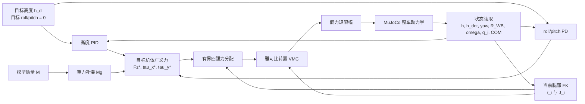

# 四轮足机器人虚拟模型控制（VMC）

## 1. 控制目标与适用范围

当前 VMC 控制器负责整车竖直方向与机体姿态控制：

1. 根据模型总质量产生整车重力补偿；
2. 将底盘高度 PID 输出直接叠加为附加虚拟推力；
3. 根据 roll 和 pitch 误差产生机体恢复力矩；
4. 将目标总推力与姿态力矩分配为四条腿的竖直支撑力；
5. 使用四连杆解析雅可比转置，将每条腿的虚拟力映射为髋关节力矩。

当前框架只控制世界坐标系竖直力以及机体 roll/pitch，不控制水平速度、轮速或 yaw。仿真会记录 yaw、pitch、roll 三轴姿态曲线；其中 yaw 曲线用于观察耦合和漂移，不代表已经实现 yaw 闭环。控制器假设四个车轮均与地面接触；真实机器人后续还需要接触检测、状态估计、驱动器模型和安全状态机。

## 2. 坐标系、状态与符号

采用右手坐标系：

- 世界系记为 $W$，$+z_W$ 竖直向上；
- 机体系记为 $B$，$+x_B$ 向前、$+y_B$ 向左、$+z_B$ 向上；
- 第 $i$ 条腿的解析坐标系记为 $L_i$；
- 四条腿同向安装，因此当前 $R_{BL_i}=I_3$；
- $R_{WB}$ 将机体系向量变换到世界系；
- roll 为绕 $+x_B$ 的转角，pitch 为绕 $+y_B$ 的转角；
- $f_i>0$ 表示地面对第 $i$ 个轮子的世界系竖直向上支撑力。

控制状态为

$$
x=
\left[
h,\ \dot h,\ \psi_B,\ \phi,\ \theta,\ \omega_x,\ \omega_y,
\ R_{WB},\ q_{FL},\ q_{FR},\ q_{RL},\ q_{RR},\ r_{COM}^B
\right].
$$

其中 $h$ 是底盘坐标原点的世界系高度，$\psi_B$ 是机体 yaw，$q_i$ 是每条腿的绝对解析髋角，$r_{COM}^B$ 是整车质心在机体系中的位置。yaw 会被记录和绘图，但当前不进入姿态反馈力矩。

## 3. 完整控制框架

### 3.1 软件分层

| 层级 | 文件 | 职责 |
| --- | --- | --- |
| 解析运动学 | `ascento_dog/kinematics/four_bar.py` | 正逆运动学、装配支路、解析轮心雅可比 |
| VMC 控制器 | `ascento_dog/control/vmc.py` | 高度 PID、姿态 PD、受力分配、虚拟力到髋力矩 |
| MuJoCo 适配 | `mujoco/simulation/mujoco_vmc.py` | 读取仿真状态、计算整车质心、写入力矩、施加扰动 |
| 动力学模型 | `mujoco/quadruped.xml` | 重力、轮地接触、闭环腿、髋力矩执行器 |
| 可视化入口 | `ascento_dog/scripts/vmc.py` | 目标高度、三轴周期扰动、实时 Viewer 和姿态记录 |
| 曲线导出 | `ascento_dog/plotting.py` | yaw/pitch/roll 曲线、扰动区间、CSV/PDF/PNG 导出 |
| 自动验证 | `tests/test_vmc.py`、`tests/test_mujoco_quadruped.py` | 数学映射、限幅、稳态与动力学回归测试 |

### 3.2 信号流



### 3.3 单个控制周期

当前 MuJoCo 步长为 $1\ \mathrm{ms}$，VMC 每个仿真步更新一次，即 $1\ \mathrm{kHz}$：

1. 从 MuJoCo 读取 $h$、$\dot h$、$R_{WB}$、机体系角速度和四个髋角；
2. 从 `subtree_com` 计算整车质心 $r_{COM}^B$；
3. 计算重力补偿 $F_g=Mg$；
4. 计算高度 PID 附加推力 $F_{PID}$；
5. 计算 roll/pitch 恢复力矩 $\tau_x^*$、$\tau_y^*$；
6. 用每条腿当前正运动学计算轮心相对质心的位置 $r_i^B$；
7. 构建姿态相关的力分配矩阵 $A$；
8. 在单腿法向力上下限内求解四个 $f_i$；
9. 计算每条腿解析雅可比 $J_i(q_i)$；
10. 将 $f_i$ 映射为髋力矩 $\tau_i$ 并限幅；
11. 将四个髋力矩写入 MuJoCo，车轮电机当前保持零输出；
12. 执行一次 MuJoCo 动力学积分；
13. 记录积分后的 yaw、pitch、roll 以及扰动开关，仿真结束后导出曲线。

### 3.4 接口定义

| 项目 | 内容 |
| --- | --- |
| 控制输入 | 目标高度、当前底盘状态、四个髋角、整车质心、模型质量 |
| 控制输出 | 四个目标竖直支撑力、四个髋关节力矩 |
| 监测输出 | yaw/pitch/roll 时序、扰动标记、CSV/PDF/PNG 曲线 |
| 更新频率 | 当前为 1 kHz |
| 力饱和 | 每腿 $0\le f_i\le120\ \mathrm{N}$ |
| 力矩饱和 | 每髋 $|\tau_i|\le40\ \mathrm{N\,m}$ |
| 积分抗饱和 | 积分限幅与条件积分 |
| 不可实现指令 | 返回实际广义力与分配残差 $Af-w^*$ |
| 非法状态 | 非有限输入、错误数组形状、越界髋角或奇异雅可比会显式报错 |

## 4. 单腿 VMC 与虚功推导

单腿轮心位置由 `leg_kinematics.md` 中的解析正运动学给出：

$$
E=E(q),
\qquad
J_E(q)=\frac{\partial E}{\partial q}
=\begin{bmatrix}J_x(q)\\J_z(q)\end{bmatrix}.
$$

虚位移满足

$$
\delta E=J_E(q)\,\delta q.
$$

若轮心虚拟力为 $F_E=[F_x,F_z]^\mathsf{T}$，根据虚功等价

$$
\delta W
=F_E^\mathsf{T}\delta E
=F_E^\mathsf{T}J_E\delta q
=\tau_q\delta q,
$$

得到

$$
\boxed{
\tau_q=J_E^\mathsf{T}F_E=J_xF_x+J_zF_z
}.
$$

控制分配变量 $f_i$ 表示地面对轮子的向上支撑力。静力平衡时，髋电机必须抵消该外力产生的广义力：

$$
\tau_i\delta q_i
+(f_i e_z^W)^\mathsf{T}\delta E_i^W=0.
$$

将平面雅可比嵌入三维：

$$
j_i^{L_i}
=\begin{bmatrix}J_x(q_i)\\0\\J_z(q_i)\end{bmatrix},
\qquad
j_i^W=R_{WB}R_{BL_i}j_i^{L_i}.
$$

因此髋力矩命令为

$$
\boxed{
\tau_i
=-f_i(e_z^W)^\mathsf{T}R_{WB}R_{BL_i}j_i^{L_i}
}.
$$

机体水平且四腿同向时，公式退化为

$$
\boxed{\tau_i=-J_z(q_i)f_i}.
$$

## 5. 重力补偿与高度 PID

整车总质量 $M$ 直接从编译后的 MuJoCo 模型读取，不在控制器中重复硬编码。静态重力补偿为

$$
F_g=Mg.
$$

定义高度误差

$$
e_h=h_d-h.
$$

高度 PID 输出为附加虚拟推力：

$$
\boxed{
F_{PID}
=K_{ph}e_h
+K_{ih}\int e_h\,dt
-K_{dh}\dot h
}.
$$

微分项使用测量速度 $\dot h$，因此目标高度阶跃不会产生微分冲击。最终目标总支撑力为

$$
\boxed{F_z^*=\max(0,Mg+F_{PID})}.
$$

这条链路中不存在额外的腿长位置环：PID 输出以牛顿为单位，直接进入四腿虚拟力分配器。

## 6. roll/pitch 姿态控制

水平姿态目标为

$$
\phi_d=0,
\qquad
\theta_d=0.
$$

姿态 PD 输出目标机体系恢复力矩：

$$
\boxed{
\tau_x^*
=-K_{p\phi}\phi-K_{d\phi}\omega_x
},
$$

$$
\boxed{
\tau_y^*
=-K_{p\theta}\theta-K_{d\theta}\omega_y
}.
$$

于是控制器希望四条腿共同实现的广义力为

$$
w^*
=\begin{bmatrix}
F_z^*\\
\tau_x^*\\
\tau_y^*
\end{bmatrix}.
$$

## 7. 任意 roll/pitch 下的四腿受力分配

### 7.1 姿态相关分配矩阵

世界竖直单位向量在机体系中的表示为

$$
n^B=R_{WB}^\mathsf{T}e_z^W.
$$

令第 $i$ 个轮心相对整车质心的位置为 $r_i^B$。轮地接触点与轮心沿世界竖直方向的偏移不会改变竖直力矩，因此可直接使用轮心位置。第 $i$ 条腿产生的机体系力矩为

$$
\tau_i^B=r_i^B\times(f_i n^B).
$$

定义

$$
a_i=r_i^B\times n^B,
$$

并令

$$
f=
\begin{bmatrix}
f_{FL}&f_{FR}&f_{RL}&f_{RR}
\end{bmatrix}^\mathsf{T},
$$

则分配方程为

$$
\boxed{Af=w^*},
$$

其中

$$
A=
\begin{bmatrix}
1&1&1&1\\
a_{FL,x}&a_{FR,x}&a_{RL,x}&a_{RR,x}\\
a_{FL,y}&a_{FR,y}&a_{RL,y}&a_{RR,y}
\end{bmatrix}.
$$

因为 $n^B$ 随 $R_{WB}$ 变化，所以该矩阵在机体已有 roll 或 pitch 时仍然成立，而不是只适用于水平近似。

### 7.2 水平对称机体的显式解

机体水平时

$$
n^B=\begin{bmatrix}0&0&1\end{bmatrix}^\mathsf{T},
\qquad
r_i^B\times n^B
=\begin{bmatrix}y_i&-x_i&0\end{bmatrix}^\mathsf{T}.
$$

若前后接触点位于 $x=\pm a$，左右接触点位于 $y=\pm b$，最小范数对称解为

$$
\boxed{
f_{FL}=\frac{F_z^*}{4}
+\frac{\tau_x^*}{4b}
-\frac{\tau_y^*}{4a}
},
$$

$$
\boxed{
f_{FR}=\frac{F_z^*}{4}
-\frac{\tau_x^*}{4b}
-\frac{\tau_y^*}{4a}
},
$$

$$
\boxed{
f_{RL}=\frac{F_z^*}{4}
+\frac{\tau_x^*}{4b}
+\frac{\tau_y^*}{4a}
},
$$

$$
\boxed{
f_{RR}=\frac{F_z^*}{4}
-\frac{\tau_x^*}{4b}
+\frac{\tau_y^*}{4a}
}.
$$

因此：

- 正 roll 需要负的 $\tau_x^*$，右腿支撑力增大、左腿支撑力减小；
- 正 pitch 需要负的 $\tau_y^*$，前腿支撑力增大、后腿支撑力减小；
- 高度 PID 只改变四条腿支撑力之和，不直接指定左右或前后差值。

四条腿同向后，轮心轨迹相对髋部存在相同的微小前偏。控制器使用实时质心与实际轮心位置构建 $A$，因此不会强制假设纯重力工况下四腿必须完全等载。

## 8. 有界分配、抗饱和与故障行为

轮地法向力只能推地，不能拉地：

$$
0\le f_i\le f_{i,\max}.
$$

当精确目标可实现时，分配器选择接近均匀承载的解；当目标超过接触或执行器能力时，求解

$$
\boxed{
\min_f
\left\|W(Af-w^*)\right\|_2^2
+\epsilon\left\|f-f_0\right\|_2^2
},
$$

满足

$$
f_{min}\le f\le f_{max}.
$$

$W$ 使用机体水平力臂对力与力矩残差做量纲归一，$f_0$ 是参考均匀分配。四条腿共有 $3^4=81$ 种“下界、自由、上界”有效集组合，当前实现穷举所有组合并选择代价最小的可行解。

控制器同时返回

$$
r_w=Af-w^*,
$$

用于判断目标是否因受力饱和而不可实现。髋力矩还会执行第二次限幅。当前框架的明确故障行为是：

- 状态包含 NaN 或无穷值：拒绝计算；
- 髋角超出解析工作区间：运动学层报错；
- 四连杆处于奇异位形：雅可比层报错；
- 目标广义力不可实现：输出最优有界力，并通过 $r_w$ 报告残差；
- 车轮失去接触：当前版本没有接触重分配，应由后续接触状态机处理。

## 9. 当前示意参数

下列参数只用于当前 MuJoCo 占位模型，不是实物标定值：

| 参数 | 当前值 | 状态 |
| --- | ---: | --- |
| 模型总质量 | 20.649425 kg | 由当前 MJCF 几何和密度自动计算 |
| 重力加速度 | 9.81 m/s² | 仿真假设 |
| 高度 PID | $K_p=1000$、$K_i=200$、$K_d=260$ | 仿真示意整定 |
| 高度积分限幅 | 0.15 m·s | 仿真示意整定 |
| PID 推力限幅 | ±180 N | 仿真示意限制 |
| roll PD | $K_p=180$、$K_d=28$ | 仿真示意整定 |
| pitch PD | $K_p=260$、$K_d=38$ | 仿真示意整定 |
| 单腿最大竖直力 | 120 N | 仿真示意限制 |
| 单髋最大力矩 | 40 N·m | 仿真示意限制 |
| 三轴扰动力矩 | $(45,-30,5)$ N·m | roll、pitch、yaw 世界系脉冲 |
| 扰动周期/持续时间 | 4.0 s / 0.15 s | 每周期中点施加一次 |

获得 CAD 质量惯量、真实轮胎参数和执行器数据后，必须重新整定并重新执行动力学验证。

## 10. 运行与验证

启动整车 VMC：

```bash
uv run vmc
```

指定平均高度、高度变化幅值、扰动强度和周期：

```bash
uv run vmc --height 0.37 --amplitude 0.03 --period 8 \
  --disturbance 45 --disturbance-period 4 --disturbance-duration 0.15
```

默认演示持续 12 s，每 4 s 施加一次持续 0.15 s 的三轴扰动力矩 $(45,-30,5)$ N·m。Viewer 关闭后会显示 yaw、pitch、roll 曲线，并在 `outputs/` 下保存：

- `vmc_attitude_response.csv`：原始姿态时序与扰动标记；
- `vmc_attitude_response.pdf`：矢量曲线；
- `vmc_attitude_response.png`：300 DPI 预览图。

橙色阴影表示扰动作用区间。yaw 当前没有闭环控制，因此重复 yaw 扰动后可能存在残余偏角。macOS 会自动通过 `mjpython` 启动 Viewer。

当前默认参数的 12 s 无界面复现实验得到：最大 roll 为 19.39°，最大 pitch 为 11.07°，最大 yaw 为 6.40°；仿真结束时 roll/pitch 已恢复到 `-0.0004° / +0.0211°`，yaw 保留约 6.40° 偏角。

无界面快速生成曲线：

```bash
uv run vmc --headless --no-show
```

全部数值验证由测试套件负责：

```bash
uv run pytest
```

测试覆盖解析雅可比、虚功符号、重力补偿、高度 PID、姿态分配、力与力矩饱和、MuJoCo 闭环误差和重力下的 VMC 稳态。测试通过只说明当前占位模型在给定工况下工作，不代表真实机器人已经满足稳定性或安全要求。
